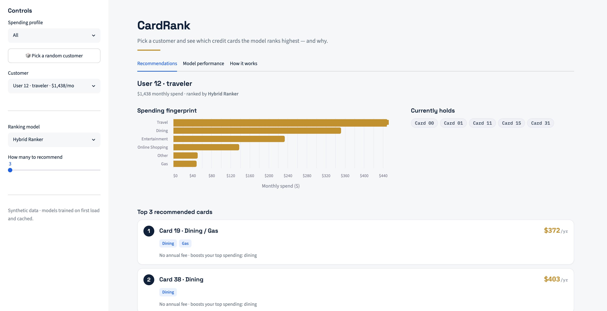
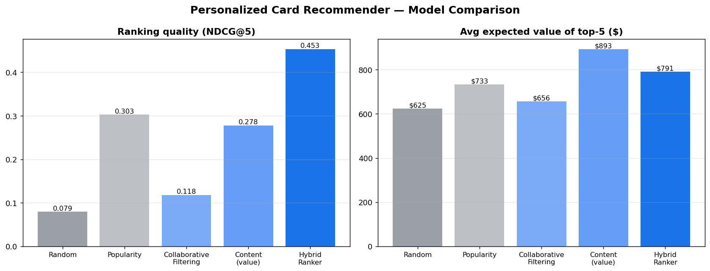
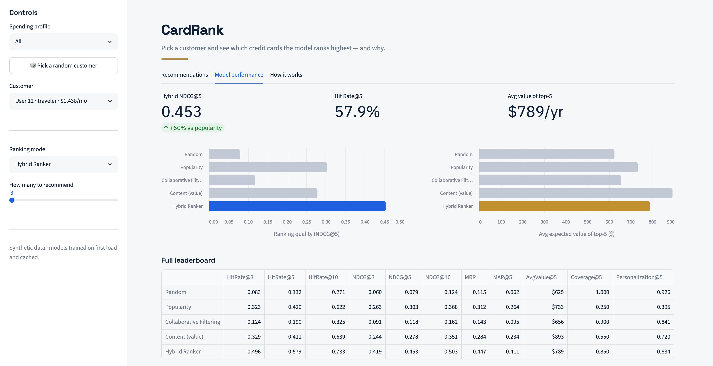

# Personalized Financial Recommendation and Ranking System



A hybrid recommender that ranks credit cards for users based on their spending
behavior. It combines **collaborative filtering** (latent embeddings learned
from co-holding patterns), **content-based scoring** (expected reward value from
a user's spend profile), and a **learning-to-rank** model that fuses these
signals with statistical card features. Built end-to-end on synthetic data, with
a rigorous leave-one-out evaluation against strong baselines.

> Stack: Python · scikit-learn · NumPy · pandas · Streamlit · matplotlib

It ships two ways to explore the models: an **interactive Streamlit web app**
(`streamlit run app.py`) and a **command-line pipeline** (`python main.py`).

---

## Results

Evaluated on 3,000 users with a leave-one-out protocol (one held-out card per
user; the model ranks every card the user does not already hold).

| Model | NDCG@5 | HitRate@5 | MRR | Avg $ Value@5 |
|---|---|---|---|---|
| Random | 0.079 | 0.132 | 0.115 | $625 |
| Popularity | 0.303 | 0.420 | 0.312 | $733 |
| Collaborative Filtering | 0.118 | 0.190 | 0.143 | $656 |
| Content (value) | 0.278 | 0.411 | 0.284 | $893 |
| **Hybrid Ranker** | **0.453** | **0.581** | **0.446** | **$791** |

**The Hybrid Ranker beats the popularity baseline by +49.8% NDCG@5, +38.2%
Hit Rate@5, and +43.2% MRR**, while surfacing cards worth ~8% more in expected
annual rewards. It wins because it is the only model that captures all three
holding signals at once.





---

## Why a hybrid? (the core idea)

In the synthetic world, a user holds a card for a *mixture* of reasons:

| Signal | What it means | Which model captures it |
|---|---|---|
| Reward value | The card pays well for how I spend | Content scorer |
| Popularity | Lots of people hold this card | Popularity baseline |
| Segment taste | People who spend like me favor these cards | Collaborative filtering |

Each single-signal model captures only one slice. The learning-to-rank model
learns to weight all three (plus card-level features), which is why it
generalizes best. Feature importances from the trained ranker confirm this —
popularity, content-similarity, and the CF embedding score all carry weight.

---

## Methodology

**Data (synthetic, self-contained).** 40 procedurally generated cards with
per-category reward rates, annual fees, and sign-up bonuses (more generous
rewards → higher fees). 3,000 users drawn from six spending archetypes
(traveler, foodie, family, commuter, online shopper, homebody). Holdings are
sampled from a softmax over a weighted blend of value, popularity, and a
segment-level affinity term.

**Models.**
- *Collaborative filtering* — TruncatedSVD over the implicit-feedback holdings
  matrix yields card embeddings. A user is represented by the mean embedding of
  the cards they hold, scored against candidate-card embeddings.
- *Content scorer* — expected annual reward value (`spend · reward_rate −
  fee + ½·bonus`) plus a cosine match between spend and reward profiles. Handles
  cold-start users with zero history.
- *Hybrid ranker* — a `GradientBoostingClassifier` trained with negative
  sampling on features `[cf_score, content_value, content_cosine, annual_fee,
  signup_bonus, card_popularity, card_generosity, user_total_spend,
  reward_rate_in_top_category]`.

**A real bug I caught and fixed.** A first version of the ranker scored *dead
last* — worse than random. Feature importance showed it was leaning ~96% on the
raw SVD reconstruction score. The cause was a **train/eval leakage mismatch**:
the reconstruction inflates a card's score precisely because the user holds it,
so training positives looked trivially separable, but held-out test cards (removed
from the matrix) did not. The fix was to make the CF signal **leave-one-out
aware** — build the user representation from their *other* cards, excluding the
target. NDCG@5 jumped from 0.082 to 0.453. See `score_user()` in
`recommender.py`.

**Evaluation.** Leave-one-out, ranking metrics (Hit Rate, NDCG, MRR, MAP) plus
business metrics (expected $ value of the top-K, catalog coverage,
personalization). Ties broken with a seeded jitter for fairness.

---

## Project structure

```
financial_recommender/
├── app.py               # Streamlit web app (interactive demo)
├── main.py              # command-line pipeline (prints results, saves chart/CSVs)
├── pipeline.py          # shared training pipeline used by app.py AND main.py
├── config.py            # categories, dataset size, signal weights, model/eval params
├── data_generation.py   # synthetic cards, users (archetypes), holdings
├── recommender.py       # CF (SVD embeddings), content scorer, hybrid LTR ranker
├── baselines.py         # random + popularity baselines
├── evaluation.py        # leave-one-out split + ranking & business metrics
├── utils.py             # z-score, softmax helpers
├── requirements.txt
├── .streamlit/
│   └── config.toml      # web app theme
└── outputs/             # results.csv, model_comparison.png, card_catalog.csv, ...
```

---

## Quickstart

```bash
# 1. (optional) create and activate a virtual environment
python -m venv .venv && source .venv/bin/activate   # Windows: .venv\Scripts\Activate.ps1

# 2. install dependencies
pip install -r requirements.txt
```

**Option A — interactive web app (recommended):**

```bash
streamlit run app.py
```

Opens in your browser. Pick a customer (or hit *random*), choose how many cards
to recommend, and switch the ranking model live. Three tabs:
- **Recommendations** — the customer's spending fingerprint and their top ranked
  cards, each with an estimated annual value and a plain-English reason.
- **Model performance** — the full leaderboard plus ranking-quality and
  expected-value charts.
- **How it works** — the three-signal idea and the trained ranker's feature
  importances.

The models train once on first load (~30s) and are cached, so the UI is snappy
afterwards.

**Option B — command-line pipeline:**

```bash
python main.py
```

Regenerates the dataset, trains all five models, prints the comparison table and
feature importances, writes a chart and CSVs to `outputs/`, and shows a worked
recommendation demo. Everything is seeded, so results are reproducible. You can
also run modules individually, e.g. `python data_generation.py` to inspect the
generated card catalog.

---

## Extending this

This is the first of three connected projects:
1. **Recommendation & ranking** ← *this repo*
2. **Synthetic financial data generator** — replace the slim generator here with
   a richer transaction-level simulator (merchants, time-series, balances).
3. **Graph-based modeling & responsible-AI evaluation** — model
   user–merchant–category relationships as a graph and add fairness /
   calibration / explainability checks.

Natural next steps for this repo specifically: swap SVD for an ALS or neural
two-tower model, add temporal validation, calibrate ranking scores, and run
per-archetype fairness slices on the recommendations.

---

## Talking points (for interviews)

- **Hybrid > single-signal, and I can prove why.** The leaderboard plus feature
  importances show each signal family contributing; the ablation is built in.
- **I found and fixed a leakage bug.** Diagnosed from a pathological feature
  importance, traced to a train/eval mismatch, fixed with LOO-aware scoring —
  with a 5x metric improvement to show for it.
- **I evaluate like a product team, not just a Kaggle leaderboard.** Ranking
  metrics *and* business metrics (expected value, coverage, personalization).
- **Cold-start is handled.** Content scoring works for users with no history.
